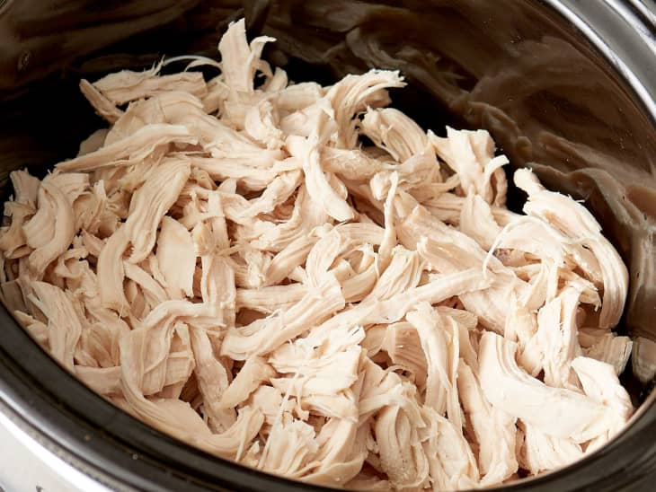

# Slow cooker shredded chicken

## Key ingredients

* Chicken breasts: You’ll need 2 pounds of boneless, skinless chicken breasts (about 4 chicken breasts).
* Chicken stock, low-sodium chicken broth, or water: I prefer chicken stock or low-sodium chicken broth if I have it on hand because it adds a little more flavor, but water works equally well. Adding some liquid to the slow cooker is an essential step, and ensures that the chicken is tender and juicy.

## Instructions

* Add the ingredients to the slow cooker. Place the chicken and stock, broth, or water in a 4-quart or larger slow cooker.
* Cook the chicken. Cover and cook until the chicken is tender and registers an internal temperature of 165°F, 4 to 5 hours on the LOW setting, or 2 to 3 hours on the HIGH setting.
* Shred the chicken. Transfer the meat to a plate or cutting board and use two forks to pull it apart. The chicken will be so soft and tender that it will practically fall apart with just a little prodding.

## Helpful tips

* How to scale the recipe up or down: Whether you’re making just a few servings or enough to feed a crowd, the effort remains the same. The important thing to remember is keeping the right ratio of chicken to liquid, which is 1/2 cup of chicken stock, low-sodium chicken broth, or water for every pound of chicken.

* The best way to shred chicken: While this technique is super simple, the chicken doesn’t actually fall apart into shreds on its own (wouldn’t that be nice!). The most important thing to know is that it’s best to shred the chicken when it’s still warm, preferably right after it’s done cooking. As the chicken cools, the muscle fibers start to tighten up, which makes it a little tougher to shred. It’s not impossible and it still works, but it takes some more effort and the meat tends to pull apart in larger chunks rather than thin, wispy shreds.

* Ways to use shredded chicken: The chicken will absorb cooking liquid while you shred, keeping it tender for chicken tacos, chicken salads, chicken casseroles, and more.

## Storage tips
Refrigerate the shredded chicken in an airtight container for up to 4 days or in the freezer for up to 4 months.
