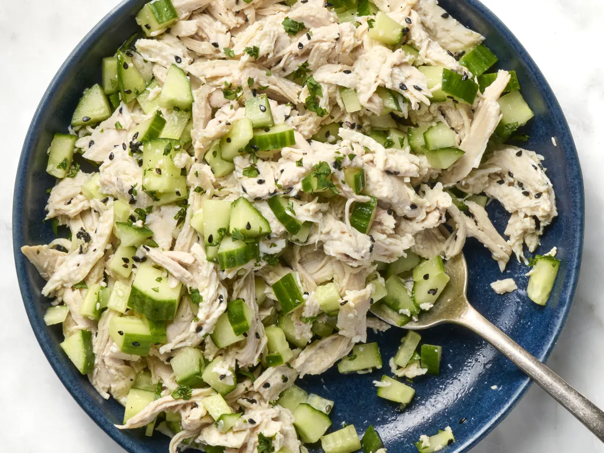

# Cucumber chicken salad

## Key ingredients
Chicken. I call for poaching boneless, skinless chicken breasts in this recipe. You’ll dice or shred the chicken into bite-size pieces.

Cucumber. You can use Persian cucumbers or an English cucumber here, either works well. 
Rice vinegar. Adds a tangy bite to the salad. 

Toasted sesame seeds. I swear by the containers of toasted sesame seeds that I find at Lotte Market and other Asian grocery stores. If you can’t find those, you can toast your own seeds.

## How to make
* Poach the chicken and chop your cucumber. Bring a pot of lightly salted water to a boil, then add the chicken and reduce the temperature to low until the chicken reaches an internal temperature of 165 degrees. While the chicken cools, chop the cucumbers. Shred or dice the chicken to get bite-size pieces.

* Make the dressing. Mix rice wine vinegar, toasted sesame seeds, salt, pepper, sesame oil, and sugar together in a large bowl.

* Finish the salad and serve. Toss the chicken and cucumbers with the dressing. To serve, scoop the salad onto mixed greens, and garnish with thinly sliced scallions or chopped cilantro. It also makes a great sandwich on sourdough bread or a baguette, just drain the dressing before assembling so the sandwich doesn’t get too soggy.

## Ingredients
Boneless, skinless chicken chicken breasts (about 1 pound total)

2 teaspoons kosher salt, divided, plus more as needed

2 Persian cucumbers or 1 large English cucumber

1/4 cup rice vinegar

1 tablespoon toasted sesame seeds

1 teaspoon granulated sugar

1/2 teaspoon toasted sesame oil

Optional: Chopped scallions or fresh cilantro, for garnish

## Instructions
Place 2 boneless, skinless chicken breasts in a large saucepan and add enough water to cover by about 2 inches. Add 1 teaspoon of the kosher salt, and bring to a boil over high heat. Reduce the heat to low and simmer until the chicken is cooked through and registers at least 165ºF in the thickest part, 8 to 10 minutes.

Transfer the chicken to a cutting board. Let cool for about 5 minutes. Meanwhile, dice 2 Persian cucumbers or 1 large English cucumber (about 3 cups). (No need to peel first or remove the seeds, but feel free to do so if you prefer.) Place the remaining 1 teaspoon kosher salt, 1/4 cup rice vinegar, 1 tablespoon toasted sesame seeds, 1 teaspoon coarsely ground black pepper, 1 teaspoon granulated sugar, and 1/2 teaspoon toasted sesame oil in a large bowl and whisk until the sugar and salt are dissolved.

Dice or shred the chicken into bite-size pieces. Add the chicken and cucumbers to the dressing and toss to combine. Taste and season with more kosher salt as needed. Garnish with chopped scallions or fresh cilantro if desired.

## Recipe notes
Substitutions: Use whatever kind of cucumber you like. I prefer Persian or English cucumbers because their seeds are small enough to include, but if you use a cuke with heftier seeds, use a spoon to remove them before dicing.

Make ahead: The salad can be made up to 4 days ahead and refrigerated in an airtight container. Stir before serving.

Storage: Refrigerate in an airtight container for up to 5 days.
