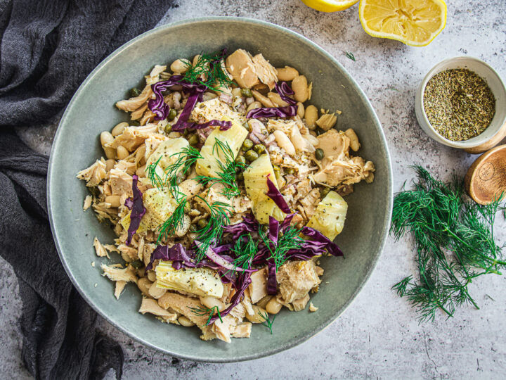

# White Bean Tuna Salad with Archichoke Hearts

Salad with Artichoke Hearts recipe, that requires mostly pantry items. It's quick, delicious, nutritious and filling.

## Prep time/total time
10 minutes

## Ingredients
2 cans Olive Oil Mediterranean Tuna
2 cups Cannellini Beans
8-10 Marinated Artichoke Hearts
1 tbsp Rice Wine Vinegar
1 tbsp Chopped Shallot
1 tbsp Fresh Dill or 1/2 tsp Dried
1 tbsp Rinsed Capers
6 tbsp Extra Virgin Olive Oil
1 tbsp Lemon Juice
1 tsp Dried Oregano
1/2 tsp Salt
1/4 tsp Freshly Ground Pepper
1/4 cup Sliced Red Cabbage

## Instructions
In a small bowl combine shallot, with olive oil, lemon juice, rice wine vinegar, salt, pepper and oregano. Mix well and set aside.

In a large shallow serving bowl, add beans, break up tuna, add artichokes, capers and toss with dressing.

Top with sliced cabbage and chopped dill. Serve right away.

Refrigerate any leftovers for up to 3 days.

## Notes
If you choose to cook your own bens, rinse 1 cup dried bens and cover with about 2 inches of water. let sit overnight.

Next day, rinse beans and cover with fresh water. Again, about 2 inches above beans. Cook for 45 minutes and check for doneness. You can cook them a little longer for softer beans.

## Nutrition information
Yield: 4
Serving size: 1

*Amount per serving*
calories 394
total fat 26g
saturated fat: 4g
trans fat: 0g
unsaturated fat: 22g
cholesterol: 10mg
sodium: 567mg
carbohydrates: 26g
fiber: 7g
sugar: 1g
protein: 16g
