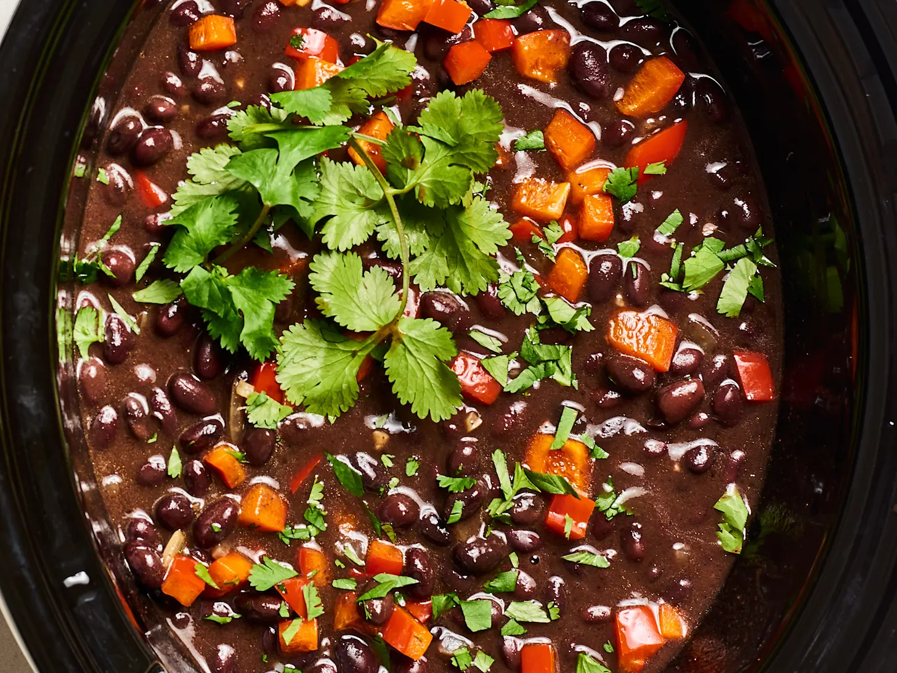

# Slow cooker black bean soup

## Ingredients
1 pound dried black beans

1 medium onion, diced

1 medium red bell pepper, cored, seeded, and diced

3 cloves garlic, minced

6 cups low-sodium vegetable broth

1 1/2 tablespoons chili powder

1 tablespoon ground cumin

2 teaspoons kosher salt

2 bay leaves

1/2 teaspoon freshly ground black pepper

## Optional toppings
Fresh cilantro leaves and stems

Chopped avocado

Greek yogurt

## Instructions

* Place the black beans, onion, bell pepper, garlic, broth, chili powder, cumin, bay leaves, salt, and pepper in a 6-quart or larger slow cooker and stir to combine. Cover and cook on the LOW setting until the beans are tender, 8 to 10 hours.

* Remove the bay leaves and serve with Greek yogurt, fresh cilantro, or chopped avocado if desired.

## Recipe notes
Storage: Leftovers can be stored in an airtight container in the refrigerator for up to 5 days or in the freezer for up to 3 months.

## Nutritional info

|  |Per serving, based on 8 servings. (% daily value)|
|--|-------------------------------------------------|
|Calories|215|
|Fat| 1.3 g (2.1%)|
|Saturated|0.3 g (1.4%)|
|Carbs|39.5 g (13.2%)|
|Fiber|10.1 g (40.5%)|
|Sugars|2.6 g|
|Protein|13.0 g (26.1%)|
|Sodium|546.2 mg (22.8%)|
